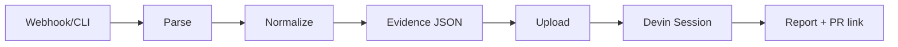

# Architecture

Incident Triage is a linear pipeline: **trigger → parse → normalize → package → Devin → outputs**. No real-time ingestion; everything is event-driven from webhooks or CLI.

## High-level flow

```
[Webhook / Fixture / CLI] → Parse → Normalize (commits + logs) → Evidence (JSON)
                                                                       ↓
                        [Devin API] ← Upload attachment + prompt + schema
                              ↓
              [Triage Report] + [Optional Patch PR] + [Optional Telemetry PR]
```

## Components

### 1. Triggers

- **Webhook server** — `POST /webhook/prometheus`, `/webhook/deploy`, `/webhook/posthog`, `/webhook/github`. Responds 200 quickly; runs triage asynchronously.
- **CLI** — `run --demo`, `run --fixture`, `run --payload`. Same normalizer and Devin path as webhooks.
- **GitHub Action** — Optional; can run the CLI on `workflow_dispatch` or `repository_dispatch` with a payload.

### 2. Signal layer

Raw payloads are parsed into a single **IncidentPayload** (id, trigger, startsAt, labels, annotations).

| Source | Parser | When it triggers |
|--------|--------|-------------------|
| Prometheus | Alertmanager v4 | `status === "firing"`; optional label filters |
| PostHog | Custom | `source === "posthog"`, funnel_id, drop_pct |
| Deploy | Generic | `source === "deploy"`, provider, error_message |
| GitHub | Native | `deployment_status` (state error/failure), `check_run` (conclusion failure), `workflow_run` (conclusion failure) |

Routing: **GitHub** by `X-GitHub-Event` header; **Prometheus** by `version` + `alerts`; **PostHog** / **Deploy** by `source` in body.

### 3. Normalizer

- **Input:** IncidentPayload + config (time window, commit depth, logs scenario).
- **Commits:** From local git (when in a repo) or GitHub API (when not). Uses `gitCommitList`, `gitDiffSummary` or equivalent.
- **Logs:** File adapter loads from `fixtures/logs/<scenario>.json` (or user-placed file). Interface allows future adapters (Datadog, Loki, etc.).
- **Output:** A directory containing **evidence.json** (incident, commits, diffSummary, baseSha, headSha, logs). This file is uploaded to Devin (no tar.gz).

### 4. Devin integration

- **Upload** — `evidence.json` is sent via `POST /v1/attachments`; we get back a URL.
- **Session** — We call `POST /v1/sessions` with prompt, attachment URL, structured_output schema (TriageReportSchema), tags, and metadata.
- **Poll** — We poll `GET /v1/sessions/:id` until status is terminal or a PR URL is present.
- **Prompt** — Deterministic playbook: identify services, correlate commits/logs, propose root cause, confidence, action (patch/rollback/investigate/none), missing telemetry; optionally open patch/telemetry PRs per config.

### 5. Outputs

- **Report** — We parse `structured_output` from the session and write markdown to `config.outputs.reportPath/<incident_id>.md`.
- **PRs** — Devin opens them; we read `pr.url` from structured output (or session fields) and log it. No Octokit PR creation in this repo.

## Data flow (Mermaid)



## Config and env

- **Config file:** `incident-triage.yaml` (optional for demos; we use defaults).
- **Env:** `DEVIN_API_KEY` (required for run), `GITHUB_TOKEN` (optional for private repo commits).

All of this is implemented in a single Node/TypeScript package: no separate services, no message queues. The webhook server is a single process that enqueues triage work in memory (fire-and-forget after 200).
